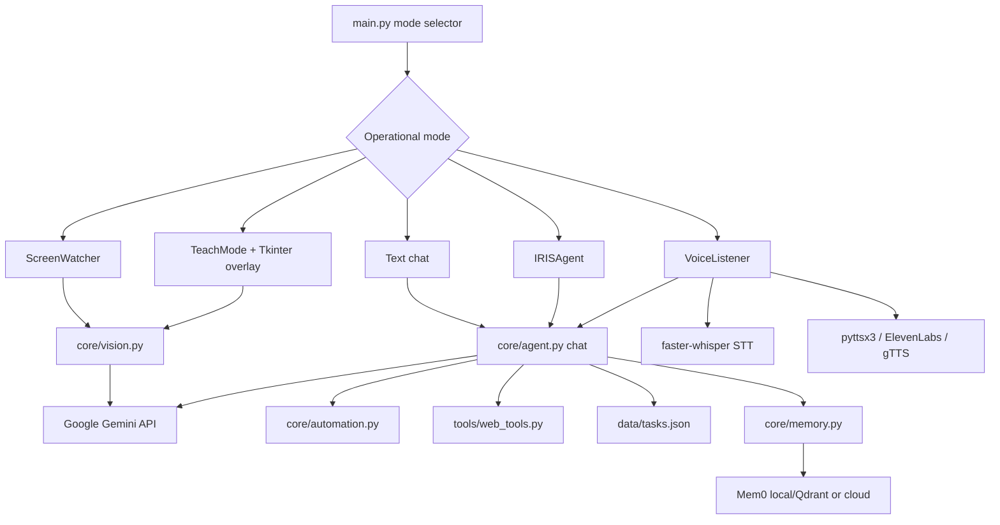

# IRIS

> **Intelligent Real-time Interactive System** — a local Python desktop assistant that helps you understand, remember, and operate your screen.

[](https://github.com/vincenzo-afk/IRIS/actions/workflows/ci.yml)
[](https://www.python.org/)
[](https://github.com/vincenzo-afk/IRIS)

[Watch the showcase video](video/renders/iris-overview.mp4) · [Report a bug](https://github.com/vincenzo-afk/IRIS/issues/new) · [Request a feature](https://github.com/vincenzo-afk/IRIS/issues/new) · [View the source](https://github.com/vincenzo-afk/IRIS)

## Table of Contents

- [About the Project](#about-the-project)
- [Tech Stack](#tech-stack)
- [Getting Started](#getting-started)
- [Usage](#usage)
- [API Reference](#api-reference)
- [Project Structure](#project-structure)
- [Features & Roadmap](#features--roadmap)
- [Testing](#testing)
- [Deployment](#deployment)
- [Contributing](#contributing)
- [Security](#security)
- [License](#license)
- [Acknowledgments](#acknowledgments)
- [Footer](#footer)

---

## <a name="about-the-project"></a>About the Project

IRIS is an early-stage desktop assistant for local, interactive computer use. It combines screen capture, Gemini-powered visual understanding, typed and spoken interaction, Mem0-backed memory, a cursor-following teaching overlay, and optional mouse-and-keyboard automation.

The application is organized around five user-facing modes. `WATCH` continuously describes the current screen, `CHAT` answers text prompts with optional screen and memory context, `TEACH` explains the interface beneath the cursor, `DO` runs a bounded Gemini function-calling task loop, and `VOICE` listens for the configured wake phrase before routing commands to chat or task execution.

IRIS can access the screen, microphone, clipboard, keyboard, mouse, and selected web content when the relevant mode is active. Treat it as a privileged desktop application: run it only on a machine and account where those permissions are appropriate, and monitor action-heavy tasks.

### Project showcase

The repository includes an editable HyperFrames composition and its rendered MP4 overview. The video is intentionally stored with its HTML source so the timing, typography, layout, and project messaging can be revised without rebuilding the application itself.

<video src="video/renders/iris-overview.mp4" controls muted playsinline width="100%">
  <a href="video/renders/iris-overview.mp4">Download the IRIS showcase video</a>
</video>

### Architecture overview



At the center of `DO` mode is an observe–act–verify loop. IRIS gathers current screen and memory context, sends a goal and tool declarations to Gemini, executes a returned action, optionally captures a verification screenshot, and repeats until the task completes or the configured maximum number of steps is reached.

---

## <a name="tech-stack"></a>Tech Stack

| Area | Technologies verified in this repository |
|---|---|
| Runtime | Python 3, standard-library threading, logging, argparse, and filesystem APIs |
| Multimodal AI | `google-generativeai`; model names are defined in `config.py` |
| Screen understanding | `mss`, Pillow, Gemini vision prompts, JPEG and Base64 encoding |
| Computer interaction | `pyautogui`, `pynput`, clipboard helpers, and platform-specific process/window helpers |
| Speech-to-text | `faster-whisper`, `sounddevice`, `soundfile`, and NumPy |
| Text-to-speech | `pyttsx3` by default, with optional ElevenLabs and gTTS branches |
| Memory | `mem0ai`, local Qdrant configuration, or Mem0 Cloud |
| Web access | `duckduckgo-search`, `requests`, and BeautifulSoup |
| Desktop overlay | Tkinter and `pynput` cursor tracking |
| Local persistence | JSON task storage at `data/tasks.json` |
| Showcase video | HyperFrames `^0.8.16`, GSAP `^3.15.0`, Node.js 22+, and FFmpeg |
| CI | GitHub Actions syntax check using `actions/checkout@v4` and `actions/setup-python@v5` |

The Python dependency specifications are maintained in [`requirements.txt`](requirements.txt). Most dependencies use minimum versions; `opencv-python-headless` and `av` are pinned. The video subproject has its own [`package-lock.json`](video/package-lock.json) for reproducible JavaScript dependency resolution.

<details>
<summary>Python dependency specification</summary>

```text
google-generativeai>=0.8.0
mem0ai>=0.1.0
pyautogui>=0.9.54
pynput>=1.7.6
mss>=9.0.1
Pillow>=10.0.0
faster-whisper>=1.0.0
elevenlabs>=1.0.0
pyttsx3>=2.90
opencv-python-headless==4.8.1.78
sounddevice>=0.4.6
soundfile>=0.12.1
numpy>=1.24.0
python-dotenv>=1.0.0
pyperclip>=1.8.2
gTTS>=2.5.0
pygame>=2.5.0
av==13.1.0
duckduckgo-search>=6.0.0
beautifulsoup4>=4.12.0
requests>=2.30.0
```
</details>

---

## <a name="getting-started"></a>Getting Started

### Prerequisites

You need Python 3 available as `python3`, a working desktop session, and permissions for the capabilities you intend to use. Voice modes need an accessible microphone and audio output. Screen and computer-control modes need a desktop environment where `mss`, `PIL.ImageGrab`, `pyautogui`, and `pynput` can operate.

A Gemini API key is required for screen, chat, agent, and memory flows. Mem0 Cloud and ElevenLabs keys are optional in the current configuration. Local memory mode expects a Qdrant service at `localhost:6333` when the local Mem0 client is successfully initialized.

### Installation

```bash
git clone https://github.com/vincenzo-afk/IRIS.git
cd IRIS
bash setup.sh
source venv/bin/activate
```

The setup script checks for `python3`, creates `venv/` if needed, upgrades `pip`, installs [`requirements.txt`](requirements.txt), and creates `.env` from [`.env.example`](.env.example) when it does not already exist.

Edit `.env` and provide a Gemini key:

```bash
$EDITOR .env
```

Then launch the interactive selector:

```bash
python main.py
```

### Configuration

The following environment variables are read by `config.py`:

| Variable | Required | Default | Purpose |
|---|---:|---|---|
| `GEMINI_API_KEY` | Yes for AI-backed modes | `YOUR_GEMINI_API_KEY_HERE` | Gemini credential for vision, chat, agent, and local-memory model calls |
| `MEM0_API_KEY` | No | Empty | Mem0 Cloud credential; `MEMORY_LOCAL` must also be changed to `False` to select the cloud path |
| `ELEVENLABS_API_KEY` | No | Empty | Credential for the optional ElevenLabs text-to-speech branch |
| `IRIS_USER_ID` | No | `iris_user_01` | Mem0 user namespace |
| `IRIS_USER_NAME` | No | `User` | Name included in assistant prompts |

```dotenv
GEMINI_API_KEY=your_gemini_api_key_here
MEM0_API_KEY=
ELEVENLABS_API_KEY=
IRIS_USER_ID=iris_user_01
IRIS_USER_NAME=YourName
```

Other runtime settings are constants in [`config.py`](config.py). They include the Gemini model names, a two-second screen-capture interval, JPEG quality, the `base` Whisper model, `pyttsx3` text-to-speech, the `hey iris` wake phrase, a top-five memory context, local-memory selection, overlay appearance, a 20-step maximum agent loop, and screenshot verification after actions.

`.env`, logs, screenshots, audio files, bytecode, virtual environments, build artifacts, and the runtime `data/` task store are excluded by [`.gitignore`](.gitignore). Never commit API keys or personal screen, audio, clipboard, or task data.

---

## <a name="usage"></a>Usage

The `--mode` argument accepts `watch`, `chat`, `teach`, `do`, or `voice`. In `do` mode, `--task` supplies the natural-language goal; without it, IRIS prompts for a task interactively.

### Watch mode

Captures the complete desktop at the configured interval, sends the image to Gemini for a description, and prints a live context line.

```bash
python main.py --mode watch
```

### Chat mode

Reads text from the terminal and adds relevant memory plus optional current-screen context to each prompt. Enter `quit`, `exit`, or `bye` to leave the loop.

```bash
python main.py --mode chat
```

### Teach mode

Starts a topmost cursor-following Tkinter widget. When the cursor remains over an area for the configured debounce interval, IRIS captures that region and asks Gemini for a concise explanation.

```bash
python main.py --mode teach
```

### Autonomous task mode

Runs the Gemini function-calling agent with mouse, keyboard, application, clipboard, web, screenshot, and task tools. The loop is bounded by `MAX_AGENT_STEPS` and can capture a fresh verification screenshot after every action.

```bash
python main.py --mode do --task "Open a terminal and type a short greeting"
```

Use narrowly scoped goals and monitor the desktop while this mode runs.

### Voice mode

Starts the screen watcher, agent, overlay, and microphone listener. The listener uses CPU-based Whisper inference with `int8` computation, detects the configured `hey iris` wake phrase, and routes task-like commands to the autonomous agent or other commands to chat.

```bash
python main.py --mode voice
```

### Agent tools

The function declarations in [`core/agent.py`](core/agent.py) expose these tool groups:

| Tool group | Functions |
|---|---|
| Mouse | `move_mouse`, `click`, `double_click`, `right_click`, `drag`, `scroll` |
| Keyboard and clipboard | `type_text`, `press_key`, `hotkey`, `get_clipboard` |
| Vision | `take_screenshot` |
| Applications | `open_app` |
| Web | `web_search`, `scrape_url` |
| Tasks | `add_task`, `list_tasks`, `mark_task_done` |
| Completion | `task_complete` |

The web helpers use DuckDuckGo search results and fetch page text with `requests` and BeautifulSoup. They are internal Python helpers; IRIS does not expose a public HTTP API.

### Rebuild the showcase video

The editable video source is [`video/index.html`](video/index.html). The project uses a local GSAP dependency and HyperFrames for validation and MP4 rendering.

```bash
cd video
npm install
npx hyperframes lint
npx hyperframes check --snapshots
npx hyperframes render --quality high --output renders/iris-overview.mp4
```

The generated MP4 is stored at [`video/renders/iris-overview.mp4`](video/renders/iris-overview.mp4). Snapshot PNGs are ignored as local verification artifacts.

---

## <a name="api-reference"></a>API Reference

IRIS is a local desktop application rather than a web server or REST API. No route definitions, OpenAPI document, database schema, or public HTTP endpoints are present in the repository.

Its external service integrations are configuration-driven:

| Service | Repository integration |
|---|---|
| Google Gemini | Screen descriptions, OCR-like screen text extraction, element location, chat, and function-calling agent responses |
| Mem0 | Persistent memory through local Qdrant configuration or Mem0 Cloud |
| DuckDuckGo Search | Search results used by the internal web tool |
| ElevenLabs | Optional text-to-speech branch |

---

## <a name="project-structure"></a>Project Structure

```text
IRIS/
├── .env.example                 # Environment-variable template
├── .github/workflows/ci.yml     # Python syntax-check workflow
├── .gitignore                   # Secrets and runtime-artifact exclusions
├── README.md                    # Project documentation and showcase embed
├── CONTRIBUTING.md              # Setup, validation, and pull-request guidance
├── SECURITY.md                  # Security and vulnerability-reporting guidance
├── config.py                    # Models, keys, runtime settings, and paths
├── main.py                      # CLI entry point and mode orchestration
├── requirements.txt             # Python dependency specifications
├── setup.sh                     # Virtual-environment and dependency setup
├── core/
│   ├── agent.py                 # Gemini tool schema and autonomous loop
│   ├── automation.py            # Mouse, keyboard, clipboard, and cursor helpers
│   ├── memory.py                # Mem0 memory adapter
│   ├── vision.py                # Screen capture and Gemini vision operations
│   └── voice.py                 # Speech-to-text, text-to-speech, and wake-word listener
├── overlay/
│   ├── cursor_widget.py         # Cursor-following Tkinter widget
│   └── teach_mode.py            # Hover-to-explain behavior
├── tools/
│   ├── input_tools.py           # Input helper exports
│   ├── screen_tools.py          # Screen helper wrappers
│   ├── system_tools.py          # App, clipboard, notification, and window helpers
│   ├── task_tools.py            # JSON-backed task persistence
│   └── web_tools.py             # Search and page-text extraction
└── video/
    ├── index.html               # Editable HyperFrames composition
    ├── package.json              # JavaScript video-tool manifest
    ├── package-lock.json         # Locked video-tool dependency tree
    └── renders/iris-overview.mp4 # Rendered README showcase
```

Runtime directories such as `venv/`, `logs/`, `screenshots/`, and `data/` are created or populated locally and are intentionally not part of the source tree.

---

## <a name="features--roadmap"></a>Features & Roadmap

### Implemented

| Feature | Evidence |
|---|---|
| Screen capture and description | `core/vision.py` uses `mss` with a Pillow fallback and sends descriptions to Gemini |
| Screen text extraction | `read_text_on_screen()` sends a screenshot to Gemini with an extraction prompt |
| Natural-language element location | `find_element()` asks Gemini for an approximate position or `NOT FOUND` |
| Background screen watching | `ScreenWatcher` captures and caches descriptions at the configured interval |
| Text chat | `chat()` injects memory and optional current-screen context without tool calling |
| Autonomous computer control | `IRISAgent` dispatches mouse, keyboard, app, clipboard, web, and task tools |
| Voice input | `faster-whisper` transcribes microphone recordings using CPU `int8` inference |
| Voice output | `pyttsx3` is the default, with ElevenLabs and gTTS branches |
| Wake-word interaction | `VoiceListener` detects the configured `hey iris` phrase |
| Cursor-following teaching overlay | `overlay/cursor_widget.py` and `overlay/teach_mode.py` provide a Tkinter overlay |
| Persistent memory | `core/memory.py` supports local Qdrant-backed and Mem0 Cloud configuration |
| Lightweight task persistence | `tools/task_tools.py` stores pending tasks in `data/tasks.json` |
| Editable project showcase | `video/index.html` is validated and rendered into the README-linked MP4 |

### Known limitations and next steps

IRIS is not currently packaged as a release, installer, container, service, or public API. The repository has no automated end-to-end test suite, dependency lockfile for Python, published license, or release workflow. Platform permissions, audio drivers, available applications, API quotas, model availability, and third-party package compatibility can affect runtime behavior.

Potential future work should be treated as project decisions rather than promises: add focused unit and integration tests, document platform-specific permissions, choose a packaging and licensing strategy, lock Python dependencies, and make high-impact computer-control actions more explicitly reviewable before execution.

There is no changelog or published release history yet.

---

## <a name="testing"></a>Testing

The repository currently has no automated application test suite. The available validation command compiles the Python source without importing third-party packages:

```bash
python -m compileall -q core overlay tools main.py config.py
```

The GitHub Actions workflow named **Python syntax check** runs this same command for pushes and pull requests targeting `main`. It uses Python `3.x` with read-only repository permissions.

For the showcase video, the validated local checks are:

```bash
cd video
npx hyperframes lint
npx hyperframes check --snapshots
```

The final video render is a 27-second, silent MP4 produced from `video/index.html`. The validation run passed runtime and layout checks; HyperFrames reports a non-blocking timeline-density warning for the single composition and small corner-label contrast warnings in its diagnostics.

---

## <a name="deployment"></a>Deployment

IRIS currently targets local desktop execution. No Dockerfile, container image, installer, cloud deployment manifest, or release package is included. The supported workflow is to create a virtual environment, install the requirements, configure `.env`, and run `main.py` on the desktop that IRIS is intended to observe or control.

Before any unattended or shared-machine deployment, the project would need an explicit packaging strategy, platform-specific permission documentation, dependency locking, service and API-key isolation, a persistent-memory plan, and end-to-end safety tests.

---

## <a name="contributing"></a>Contributing

Contributions are welcome through focused pull requests. Read [`CONTRIBUTING.md`](CONTRIBUTING.md) for setup, validation, branch guidance, and pull-request expectations.

Please keep changes narrowly scoped, avoid committing secrets or runtime data, document behavior changes in the README, and describe any new network request, permission, external service, or computer-control behavior. A pull request should include the exact validation command or manual scenario used.

---

## <a name="security"></a>Security

IRIS is a privileged desktop automation program. Depending on the mode and configuration, it can capture screen contents, record microphone input, read the clipboard, send images or text to third-party AI services, fetch web pages, and control the mouse and keyboard.

Use environment variables for credentials, keep `.env` local, avoid unattended `DO` or `VOICE` operation on sensitive machines, and inspect the target screen before granting an action-heavy goal. Report vulnerabilities privately according to [`SECURITY.md`](SECURITY.md); do not publish exploit details, credentials, personal captures, audio, clipboard data, or task data in a public issue.

---

## <a name="license"></a>License

This repository does not currently contain a `LICENSE` file. Until the owner adds a license, the source should be treated as **all rights reserved** and should not be redistributed or reused beyond permissions granted by the copyright holder.

---

## <a name="acknowledgments"></a>Acknowledgments

IRIS is maintained by [vincenzo-afk](https://github.com/vincenzo-afk). The implementation uses Google Generative AI, Mem0, Pillow, mss, pyautogui, pynput, faster-whisper, Tkinter, DuckDuckGo Search, Requests, BeautifulSoup, and related Python packages listed in [`requirements.txt`](requirements.txt).

The README showcase uses [HyperFrames](https://github.com/heygen-com/hyperframes) and [GSAP](https://gsap.com/) to keep the project video editable as HTML.

---

## <a name="footer"></a>Footer

[Back to top](#iris) · [GitHub repository](https://github.com/vincenzo-afk/IRIS) · [Issues](https://github.com/vincenzo-afk/IRIS/issues)

For security reports, use the private reporting guidance in [`SECURITY.md`](SECURITY.md). For general project questions, open a concise issue with reproducible steps and redact secrets and personal data.

**Built by [vincenzo-afk](https://github.com/vincenzo-afk).**

## References

1. [Google Gemini API documentation](https://ai.google.dev/gemini-api/docs)
2. [Mem0 documentation](https://docs.mem0.ai/)
3. [Python documentation](https://docs.python.org/3/)
4. [HyperFrames repository](https://github.com/heygen-com/hyperframes)
5. [GitHub Topics documentation](https://docs.github.com/en/repositories/managing-your-repositorys-settings-and-features/customizing-your-repository-with-topics)
